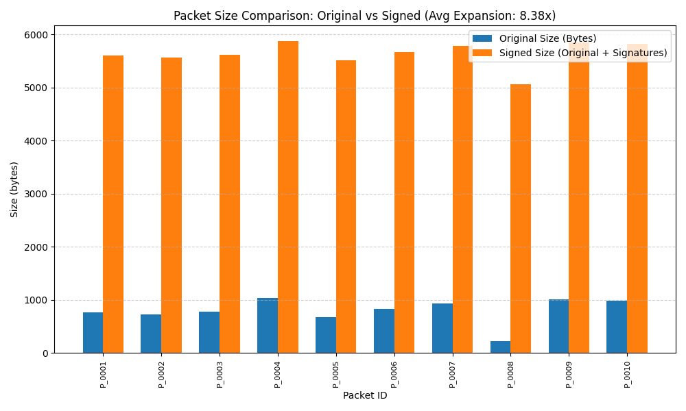
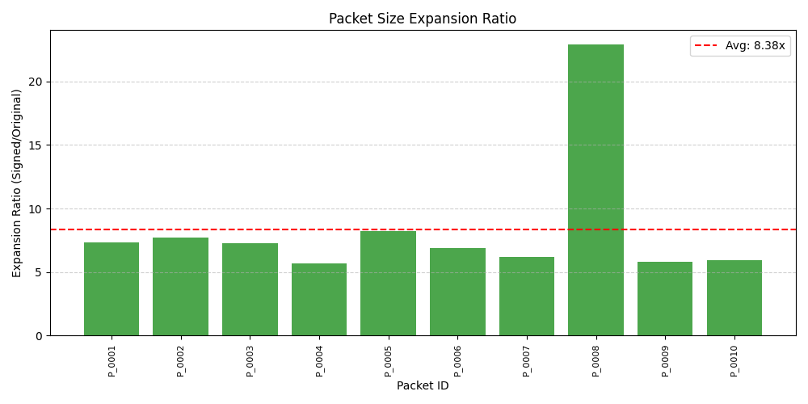
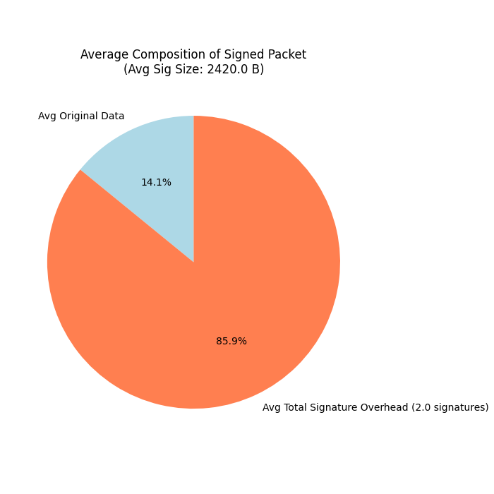
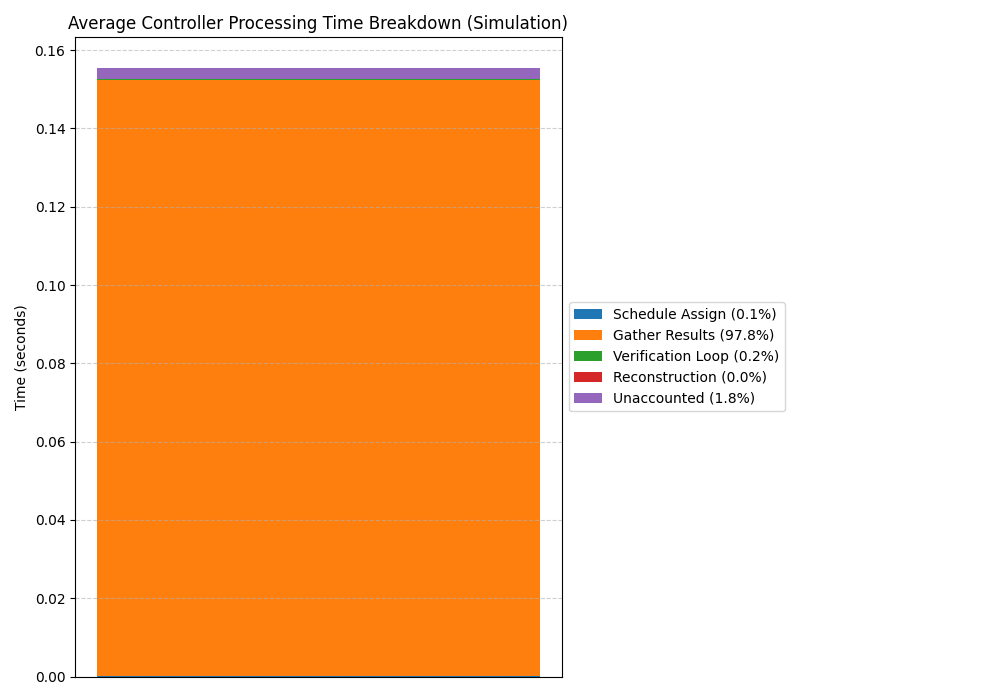
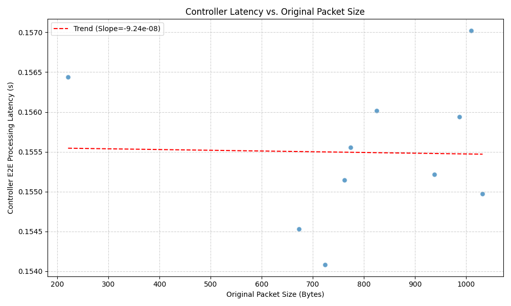
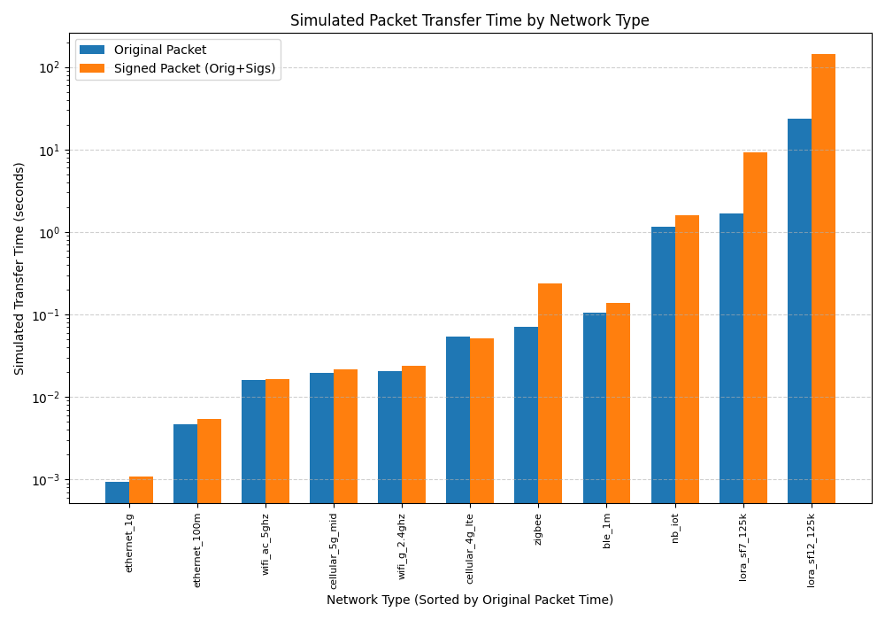
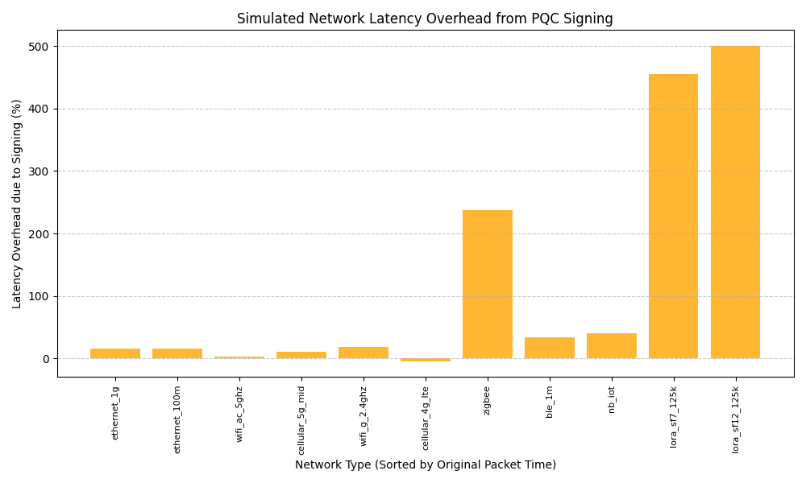

# PQC Signing Performance Analysis Report

*Generated on: 2025-04-22 17:41:02*

---

## 1. Packet Size Analysis

* **Packets Analyzed**: 10
* **Avg Original Packet Size**: 794.6 bytes
* **Avg Signed Size (Original + Signatures)**: 5634.6 bytes
* **Avg Expansion Ratio**: 8.38x
* **Avg Individual Signature Size**: 2420.0 bytes

### Detailed Per-Packet Analysis (Sample)

| Packet ID | Original Size (B) | Signed Size (B) | Expansion Ratio | Subpackets | Avg Sig Size (B)|
|-----------|-------------------|-----------------|-----------------|------------|-----------------|
| P_0001 | 762 | 5602.0 | 7.35x | 2 | 2420.0 |
| P_0002 | 724 | 5564.0 | 7.69x | 2 | 2420.0 |
| P_0003 | 774 | 5614.0 | 7.25x | 2 | 2420.0 |
| P_0004 | 1032 | 5872.0 | 5.69x | 2 | 2420.0 |
| P_0005 | 673 | 5513.0 | 8.19x | 2 | 2420.0 |
| P_0006 | 825 | 5665.0 | 6.87x | 2 | 2420.0 |
| P_0007 | 938 | 5778.0 | 6.16x | 2 | 2420.0 |
| P_0008 | 221 | 5061.0 | 22.90x | 2 | 2420.0 |
| P_0009 | 1010 | 5850.0 | 5.79x | 2 | 2420.0 |
| P_0010 | 987 | 5827.0 | 5.90x | 2 | 2420.0 |

---

## 2. Controller Timing Breakdown (Simulation)

Analysis of time spent within the controller's main processing loop per packet (based on 10 processed packets).

* **Avg Total Controller E2E Latency**: 0.1555 s (Median: 0.1554 s)

### Average Time per Component

| Component         | Avg Time (s) | % of Total E2E | StDev (s) |
|-------------------|--------------|----------------|-----------|
| Schedule Assign   |     0.000141 |            0.1% |  0.000019 |
| Gather Results    |     0.152129 |           97.8% |  0.000406 |
| Verification Loop |     0.000349 |            0.2% |  0.000041 |
| Reconstruction    |     0.000004 |            0.0% |  0.000001 |
| Unaccounted       |     0.002869 |            1.8% |  0.000819 |
| Sum Components    |     0.152623 |           98.2% |  0.000437 |

*Note: 'Gather Results' includes simulated network delays and signer processing/signing time.*
*Note: 'Unaccounted' time represents overhead not captured in other components (loops, locks, etc.).*

---

## 3. Latency vs Packet Size (Simulation)

Analysis of how the controller's end-to-end processing latency (measured in the simulation) varies with the original packet size.

* **Average Original Packet Size Analyzed**: 794.6 bytes
* **Average Controller E2E Latency**: 0.1555 s
*Note: Latency includes scheduling, network simulation delays, signer work (host CPU crypto + simulated delay), verification, etc., as measured within the controller loop.*

---

## 4. Network Performance Analysis (Simulated)

Simulated transfer times for average packet sizes across different network technologies.

### Transfer Time Comparison

| Network Type       | Original Packet (s) | Signed Packet (s) | Latency Overhead (%) |
|--------------------|---------------------|-------------------|----------------------|
| ethernet_1g        |              0.0009 |            0.0011 |                15.86 |
| ethernet_100m      |              0.0046 |            0.0054 |                16.31 |
| wifi_ac_5ghz       |              0.0161 |            0.0165 |                 2.50 |
| cellular_5g_mid    |              0.0194 |            0.0215 |                10.71 |
| wifi_g_2.4ghz      |              0.0204 |            0.0241 |                18.04 |
| cellular_4g_lte    |              0.0536 |            0.0513 |                -4.27 |
| zigbee             |              0.0705 |            0.2382 |               237.84 |
| ble_1m             |              0.1041 |            0.1395 |                34.01 |
| nb_iot             |              1.1468 |            1.6099 |                40.39 |
| lora_sf7_125k      |              1.6571 |            9.2078 |               455.65 |
| lora_sf12_125k     |             23.6539 |          142.0218 |               500.42 |

---

## 5. Conceptual Performance Equations

These equations provide a simplified conceptual model for performance estimation.
**Note:** Coefficients (β, γ, P_cpu, ε_network) are derived from simulation or are illustrative placeholders and require validation with real hardware measurements.

### Packet Size Model

* **Equation**: `S_signed = S_original + (β * N_subpackets)`
* **β (Avg Sig Size)**: 2420.0 bytes

### Network Transfer Time Model

* **Equation**: `T_transfer = BaseLatency + ((S_signed * 8) / Bandwidth_bps)`
* *(BaseLatency and Bandwidth_bps depend on the specific network type)*

### Total Latency Model (Signer CPU + Network)

* **Equation**: `T_total = T_cpu_sign + T_transfer`
* **CPU/Sign Time**: `T_cpu_sign = γ * S_original`
    * γ_arduino: 1.89e-04 (s/byte)
    * γ_raspberrypi: 3.78e-05 (s/byte)
    * γ_fpga: 1.26e-06 (s/byte)

### Energy Consumption Model

* **Equation**: `E_total = E_cpu + E_network = (P_cpu * T_cpu_sign) + (ε_network_jpb * S_signed)`
    * P_cpu_arduino: 0.050 W
    * P_cpu_raspberrypi: 2.500 W
    * P_cpu_fpga: 1.500 W
    * ε_network_bluetooth: 1.00e-07 J/byte
    * ε_network_wifi: 5.00e-08 J/byte
    * ε_network_cellular: 2.00e-07 J/byte
    * ε_network_low_power_wan: 5.00e-06 J/byte

---

## 6. Sample Performance Predictions

Predictions based on the conceptual equations for specific scenarios.

| Scenario | Device      | Network          | Pkt Size (B) | Subs | Signed (B) | CPU (s) | Net (s) | Total (s) | Energy (J) |
|----------|-------------|------------------|--------------|------|------------|---------|---------|-----------|------------|
| 1        | Arduino     | ble_1m           |          200 |    1 |     2620.0 |  0.0378 |  0.1210 |    0.1587 |   0.002150 |
| 2        | Arduino     | lora_sf12_125k   |          100 |    1 |     2520.0 |  0.0189 | 71.0172 |   71.0361 |   0.013544 |
| 3        | RaspberryPi | wifi_g_2.4ghz    |          500 |    3 |     7760.0 |  0.0189 |  0.0231 |    0.0420 |   0.047582 |
| 4        | FPGA        | ethernet_100m    |         1000 |    4 |    10680.0 |  0.0013 |  0.0059 |    0.0071 |   0.002422 |
| 5        | RaspberryPi | cellular_4g_lte  |          300 |    2 |     5140.0 |  0.0113 |  0.0521 |    0.0634 |   0.029344 |
| 6        | Arduino     | nb_iot           |           50 |    1 |     2470.0 |  0.0094 |  1.3293 |    1.3388 |   0.000966 |

---

## 7. Recommendations for Resource-Constrained Devices

Based on the analysis, here are recommendations for implementing PQC signing on resource-constrained devices:

1.  **Signature Size Impact**: The average signature size (2420.0 B for ML-DSA-44) significantly increases packet size (average expansion ratio 8.38x). Choose PQC schemes/parameter sets carefully balancing security and size.
2.  **Subpacket Strategy**: Increasing subpackets adds signature overhead. For low-bandwidth networks (LoRa, NB-IoT, BLE), minimize subpackets (ideally 1) to reduce transmission time/energy. For higher bandwidth, more subpackets can allow parallel signing on faster devices (RPi, FPGA) if available, potentially reducing overall latency despite size increase.
3.  **Network Choice**: Network latency and bandwidth dominate total time for slow networks (see $T_{transfer}$). Wi-Fi/Ethernet significantly reduce transfer time compared to LPWAN/BLE. Choose networks appropriate for the required data rate and acceptable latency.
4.  **Device Capability**: Signing time ($T_{sign}$ component within $T_{HW\_Signer}$) is a major factor on low-end MCUs. Offloading signing to more capable devices (RPi, FPGA) or using hardware acceleration is crucial for performance. FPGAs offer the lowest signing latency in this simulation (reflected in lower $\gamma_{fpga}$).
5.  **Controller Performance**: While often faster than signers/networks, controller tasks ($T_{sched}$, $T_{verify}$) contribute to latency. Ensure the controller hardware ($H_C$) is adequate, especially if handling many devices or performing complex verification.
6.  **Energy Trade-offs**: CPU-intensive signing on MCUs ($P_{cpu} * T_{cpu\_sign}$) and long transmission times on LPWANs ($\epsilon_{network} * S_{signed}$) are major energy drains. Consider sleep modes, batching operations, and optimizing data transmission frequency.

---

