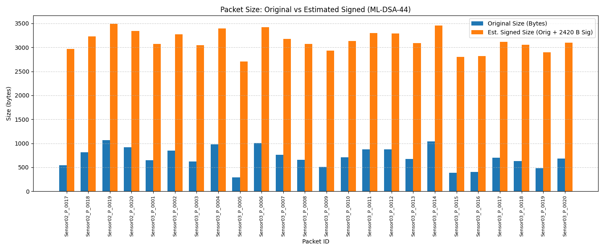
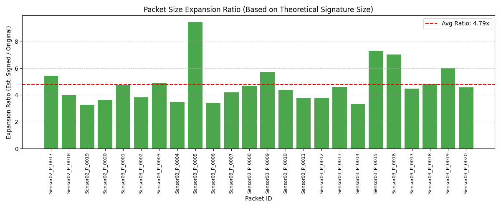
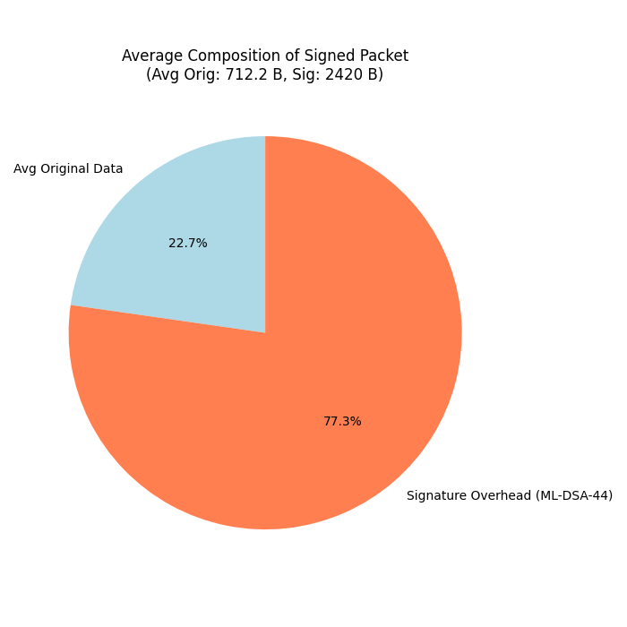
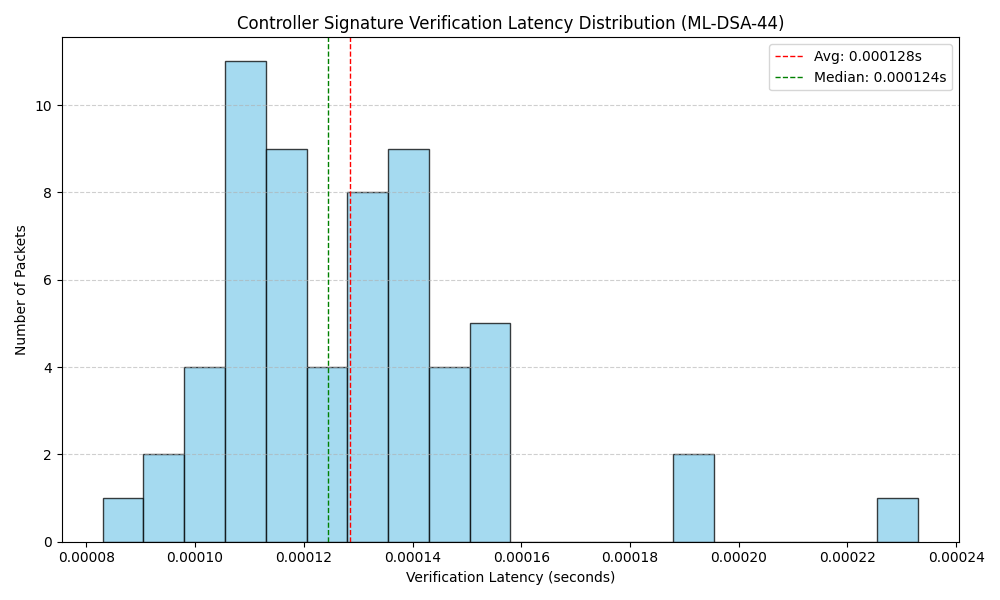
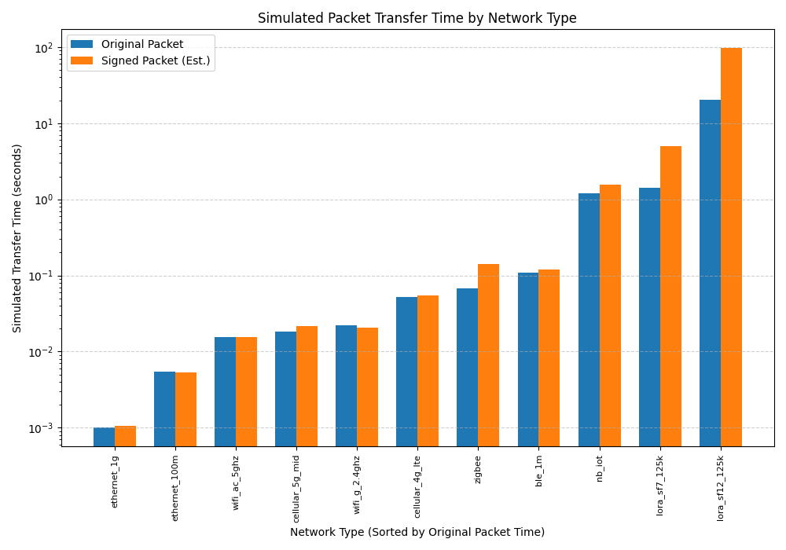
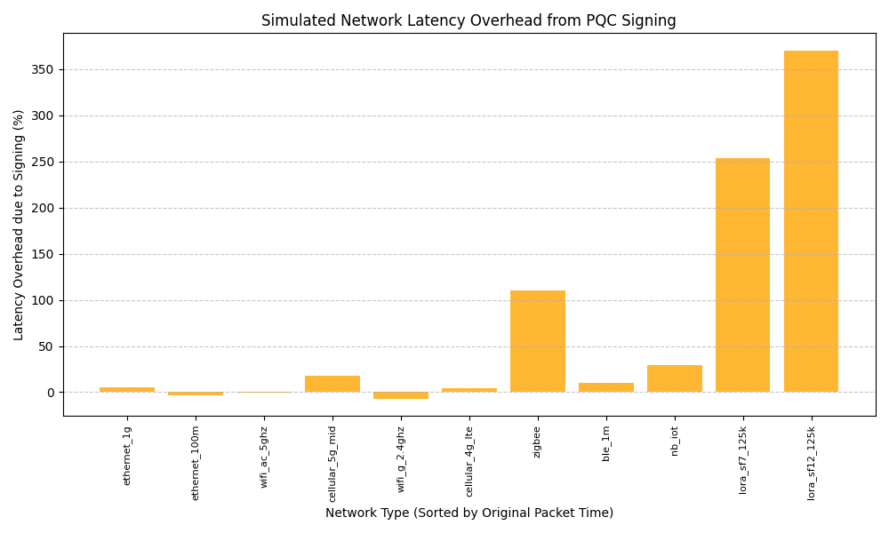

# PQC Signing Performance Analysis Report (Sensor-Signer Model)

*Generated on: 2025-04-24 17:33:02*

*PQC Algorithm: ML-DSA-44*

---

## 1. Packet Size and Verification Summary

* **Packets Generated by Sensor(s)**: 24
* **Packets Received & Verification Attempted by Controller**: 60
* **Packets Verified Successfully**: 60 (100.0% success rate)
* **Packets Failed Verification**: 0

* **Avg Original Packet Size**: 712.2 bytes
* **Theoretical Signature Size (ML-DSA-44)**: 2420 bytes
* **Avg Estimated Signed Packet Size**: 3132.2 bytes
* **Avg Expansion Ratio (Estimated)**: 4.79x

---

## 2. Controller Verification Latency (Simulation)

Analysis of time spent purely on signature verification within the controller (based on 60 successfully verified packets).

* **Avg Verification Latency**: 0.000128 s
* **Median Verification Latency**: 0.000124 s
* **Std Dev**: 0.000025 s
* **Min / Max**: 0.000083 s / 0.000233 s

---

## 3. Network Performance Analysis (Simulated)

Simulated transfer times for average packet sizes across different network technologies (Sensor-Signer to Controller).

### Transfer Time Comparison

| Network Type       | Original Packet (s) | Signed Packet (Est, s) | Latency Overhead (%) |
|--------------------|---------------------|------------------------|----------------------|
| ethernet_1g        |              0.0010 |                 0.0011 |                 4.97 |
| ethernet_100m      |              0.0054 |                 0.0053 |                -2.92 |
| wifi_ac_5ghz       |              0.0156 |                 0.0154 |                -0.92 |
| cellular_5g_mid    |              0.0182 |                 0.0214 |                17.79 |
| wifi_g_2.4ghz      |              0.0221 |                 0.0206 |                -6.87 |
| cellular_4g_lte    |              0.0523 |                 0.0547 |                 4.51 |
| zigbee             |              0.0679 |                 0.1424 |               109.82 |
| ble_1m             |              0.1085 |                 0.1191 |                 9.77 |
| nb_iot             |              1.1955 |                 1.5454 |                29.28 |
| lora_sf7_125k      |              1.4032 |                 4.9619 |               253.62 |
| lora_sf12_125k     |             20.5147 |                96.3980 |               369.90 |

---

## 4. Conceptual Performance Equations

These equations provide a simplified conceptual model for performance estimation in the Sensor-Signer architecture.
**Note:** Coefficients (β, γ, T_verify, P_cpu, ε_network) are derived from simulation averages or are illustrative placeholders.

### Packet Size Model

* **Equation**: `S_signed = S_original + β`
* **β (Sig Size)**: 2420 bytes

### Network Transfer Time Model

* **Equation**: `T_transfer = BaseLatency + ((S_signed * 8) / Bandwidth_bps)`

### Total Latency Model (Sensor Sign + Network + Controller Verify)

* **Equation**: `T_total = T_sensor_sign + T_transfer + T_controller_verify`
* **Sensor Sign Time**: `T_sensor_sign = γ * S_original`
  * γ_arduino: 3.51e-04 s/byte
  * γ_raspberrypi: 7.02e-05 s/byte
  * γ_fpga_accel: 7.02e-06 s/byte
* **Avg Controller Verify Time**: 0.000128 s

### Sensor Energy Consumption Model

* **Equation**: `E_total = E_sensor_sign + E_network = (P_sensor_cpu * T_sensor_sign) + (ε_network_jpb * S_signed)`

---

## 5. Sample Performance Predictions

Predictions based on the conceptual equations for specific Sensor-Signer scenarios.

| Scenario | Sensor Type | Network          | Pkt Size (B) | Signed (B) | Sign (s)| Net (s) | Verify (s)| Total (s)| Energy (J) |
|----------|-------------|------------------|--------------|------------|---------|---------|-----------|----------|------------|
| 1        | Arduino     | ble_1m           |          200 |     2620.0 |  0.0702 |  0.1210 |  0.000128 |   0.1913 |   0.003772 |
| 2        | Arduino     | lora_sf12_125k   |          100 |     2520.0 |  0.0351 | 71.0172 |  0.000128 |  71.0525 |   0.014355 |
| 3        | RaspberryPi | wifi_g_2.4ghz    |          500 |     2920.0 |  0.0351 |  0.0212 |  0.000128 |   0.0564 |   0.087896 |
| 4        | FPGA_Accel  | ethernet_100m    |         1000 |     3420.0 |  0.0070 |  0.0053 |  0.000128 |   0.0124 |   0.010701 |
| 5        | RaspberryPi | cellular_4g_lte  |          300 |     2720.0 |  0.0211 |  0.0511 |  0.000128 |   0.0723 |   0.053194 |
| 6        | Arduino     | nb_iot           |           50 |     2470.0 |  0.0175 |  1.3293 |  0.000128 |   1.3470 |   0.001372 |

---

